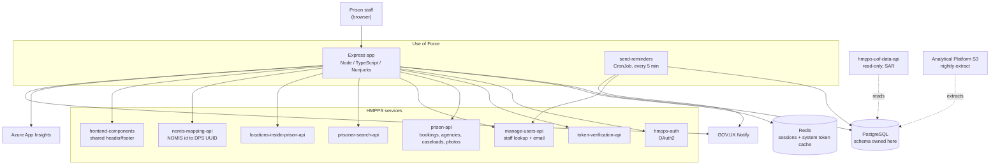
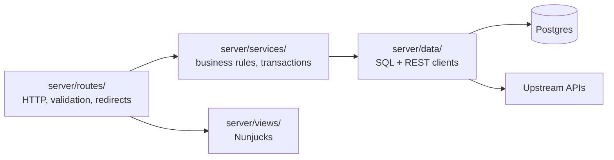

# Architecture

## What makes Use of Force different

Most HMPPS DPS services are a thin Node frontend talking to a Kotlin API that owns the data. **Use of
Force is not.** There is no service API for writes. This Express app:

- owns the Postgres schema, via the knex migrations in `migrations/`
- performs every read and write itself, in hand-written SQL in `server/data/*Client.ts`
- manages its own transactions, in `server/data/dataAccess/db.ts`

`hmpps-uof-data-api` (Kotlin) reads the same database but is **read-only**, and exists to serve
Subject Access Requests. It has no production migrations. Schema changes belong here.

Two consequences worth internalising before you change anything:

1. **Business rules that would normally live in an API live in `server/services/`.** State
   transitions are enforced by `WHERE status = $expected` guards in SQL, not by database constraints.
2. **`knex` is for migrations only.** Every runtime query uses raw `pg`. Do not reach for the knex
   query builder in application code — nothing else does.

## Context



## Layers



The dependency direction is strict: routes never touch `server/data/` directly, services never
render. Services are wired in `server/services/index.ts` — a plain factory function, no DI
container. `export type Services = ReturnType<typeof services>` is the type every route module
receives.

## Directory tour

| Path | Contents |
| --- | --- |
| `server/index.ts` | Composition root — three lines, `createApp(services())`. |
| `server/app.ts` | The entire Express wiring. See the middleware stack below. |
| `server/config.ts` | The typed config object, built from environment variables. |
| `server/config/` | **Domain** config, not app config. Form definitions, URL paths, enums. |
| `server/config/incident.ts` | `paths` — the single source of truth for every URL — plus `nextPaths` and the form schema maps. |
| `server/config/types.ts` | Every labelled enum: `ReportStatus`, `StatementStatus`, `ControlAndRestraintPosition`, `UofReasons`… |
| `server/config/forms/` | Joi schemas, one per form page. |
| `server/config/edit/` | Metadata driving the coordinator edit flow and its change display. |
| `server/authentication/` | Passport OAuth2 strategy, sign-in service, token verification. |
| `server/data/` | Postgres clients (`incidentClient`, `draftReportClient`, `statementsClient`, `reportLogClient`) and REST clients for every upstream API. |
| `server/middleware/` | Session, CSRF, auth, role checks, current user, system token refresh, frontend components. |
| `server/routes/` | Five route groups plus `api.js`. |
| `server/services/` | Business logic. |
| `server/types/` | `express.d.ts` augmentations, domain types, and generated OpenAPI types for three upstream APIs. |
| `server/utils/` | Nunjucks setup, pagination, HMAC URL signing, date helpers, App Insights. |
| `server/views/` | Nunjucks templates — `formPages/` for the report wizard, `pages/` for everything else. |

Note the two different "config" concepts: `server/config.ts` is environment configuration;
`server/config/` is domain configuration. They are unrelated despite the names.

## Bootstrap and middleware order

`server.ts` does three things, in order:

1. imports `applicationinsights` **first**, so it can instrument bunyan and express before anything
   else is required
2. runs `knex.migrate.latest()`
3. only then calls `app.listen()`

`server/app.ts` then builds the stack. The order matters in a few places:

| # | Middleware | Note |
| --- | --- | --- |
| 1 | Passport strategy init | |
| 2 | `setUpEnvironmentName`, `nunjucksSetup` | |
| 3 | `helmet()` with CSP | A per-request nonce is generated into `res.locals.cspNonce`. The frontend-components URL is added to script/style/img/font sources. |
| 4 | `X-Request-Id` → `req.id` | |
| 5 | `setUpWebSession()` | `connect-redis` when `REDIS_ENABLED`, otherwise `MemoryStore`. Cookie `use-of-force.session`, rolling, 120-minute default expiry. |
| 6 | `passport.initialize()` / `session()` | |
| 7 | Body parsers, compression | |
| 8 | Static assets under `/assets` | Cache-busted by a `version` value fixed at boot in production. |
| 9 | `GET /health` | Pings auth, prison-api and token-verification. 503 when unhealthy. |
| 10 | `setUpCsrf()` | Uses `csrf-sync`, reads the token from `req.body._csrf` rather than a header, and is **disabled when `NODE_ENV=test`**. |
| 11 | Auth endpoints | `/login`, `/login/callback`, `/sign-out`, `/autherror`. |
| 12 | `populateCurrentUser`, `refreshSystemToken` | |
| 13 | **`unauthenticatedRoutes`** | Mounted *before* the authorisation middleware — this is deliberate, so emailed removal-request deep links work without a login. |
| 14 | `authorisationMiddleware` | Decodes roles from the JWT, or redirects to `/login`. |
| 15 | Frontend components | |
| 16 | `createRouter(...)` | The application routes. |
| 17 | `errorHandler` | Renders `pages/error`; hides message and stack in production. |

Route handlers are wrapped in `asyncMiddleware` so rejected promises reach the error handler.

## Routing

All routes mount at `/`; every prefix is baked into the path strings, and canonical URLs are built
from the `paths` object in `server/config/incident.ts`. Never hard-code a URL — add it to `paths`.

| Route group | Purpose | Guard |
| --- | --- | --- |
| `routes/creatingReports/` | The report wizard: prisoner search, task list, the six form pages, check your answers. | Authenticated |
| `routes/viewingReports/` | A user's own reports and their statements. | Authenticated |
| `routes/viewingIncidents/` | `/:incidentId/view-incident`, tabbed by `?tab=report\|statements\|edit-history`. | Ownership, falling back to reviewer/coordinator |
| `routes/maintainingReports/` | Reviewer list and detail views; coordinator edit, delete and staff management. | `reviewerOrCoordinatorOnly` / `coordinatorOnly` |
| `routes/unauthenticated/` | Statement removal requests from emailed links. | HMAC signature |
| `routes/api.js` | `GET /api/offender/:bookingId/image` — streams the prison-api photo. | Authenticated |

## Authentication and authorisation

**Two tokens are in play**, which surprises people:

- the **user token**, obtained through the OAuth2 authorization-code flow and stored in the
  Redis-backed session (passport's `serializeUser`/`deserializeUser` are identity functions, so the
  whole user object lives in the session)
- the **system token**, a client-credentials token on `req.session.systemToken`, refreshed by
  `server/middleware/refreshSystemToken.ts` when it is within 60 seconds of expiry, and cached in
  Redis by `hmppsAuthClient`

Use the user token for calls made on the user's behalf; the system token for calls the app makes on
its own account.

Every authenticated request additionally requires a live token-verification check
(`POST /token/verify`), unless `TOKENVERIFICATION_API_ENABLED` is false, in which case
`NullTokenVerifier` passes everything.

Roles are decoded from the token's `authorities` claim in `server/middleware/authorisationMiddleware.ts`:

```ts
export const COORDINATOR = 'ROLE_USE_OF_FORCE_COORDINATOR'
export const REVIEWER = 'ROLE_USE_OF_FORCE_REVIEWER'
export const ADMIN = 'ROLE_NOMIS_BATCHLOAD'
```

They become `res.locals.user.isReviewer` (true for reviewer **or** coordinator), `isCoordinator` and
`isAdmin`. Route guards are in `server/middleware/roleCheck.js`.

**Caseload scoping is narrower than you might assume.** `populateCurrentUser` reads
`/api/users/me` from prison-api to get `activeCaseLoadId`, and the reviewer *list* queries filter on
it in SQL (`getIncompleteReportsForReviewer(agencyId)`, `getCompletedReportsForReviewer(agencyId, …)`).
Individual report and statement views are guarded by **role only**, not by agency.

The one unauthenticated path is the statement-removal request. Its links carry an HMAC signature
built by `getRemovalRequestLink` and verified with `isHashOfString` against `URL_SIGNING_SECRET`; an
invalid signature returns 404.

## Views

Nunjucks, configured in `server/utils/nunjucksSetup.ts`, searching `server/views`, govuk-frontend and
@ministryofjustice/frontend. Around 25 custom filters are registered — `findError`/`findErrors` for
GOV.UK error summaries, `formatDate`/`extractDate`/`extractTime`, `toSelect`/`toChecked`/`toOptions`,
`toPagination`, `toYesNo*` and `toNoDataEntered*`. Check the filter list before writing formatting
logic in a route.

Note that views are plain files copied into `dist/` by the `copy-views` script, not compiled — the
`watch-views` watcher exists for this reason.

## Asynchronous work

There are **no in-process timers, cron jobs or queues** in the web app. The only background workload
is the `send-reminders` Kubernetes CronJob (`job/sendReminders.ts`), covered in
[process-flows.md](process-flows.md#statement-reminders). It builds its own clients rather than
reusing `services()`.

## Code that looks live but isn't

Save yourself the detour:

| Path | Status |
| --- | --- |
| `server/routes/maintainingReports/admin.ts` | Not imported anywhere. |
| `adminOnly` in `server/middleware/roleCheck.js` | Unused. |
| `server/services/reporting/*` (four aggregators) | Not referenced by any route, service or job. |
| `server/data/tokenStore.ts` | Legacy duplicate of `server/data/tokenStore/tokenStore.ts`; only its own test imports it. |
| `husky.hooks` block in `package.json` | Husky v4 format, ignored by husky v9. |
