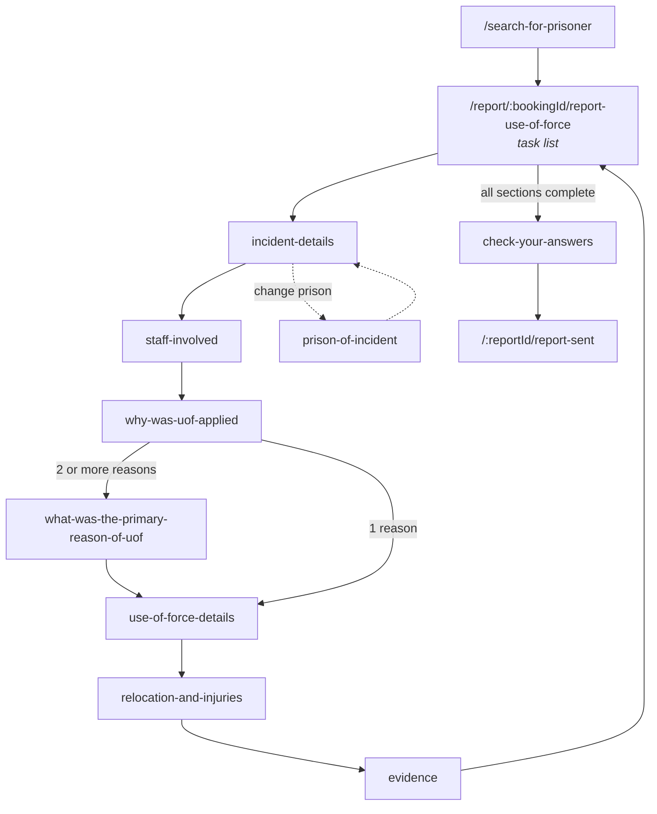
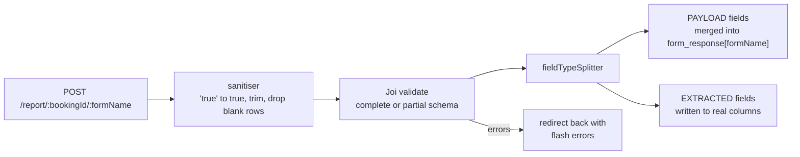
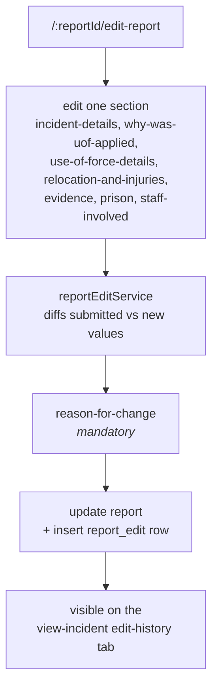

# Creating and editing a report

A high-level tour of the two journeys that matter most, and the code pattern behind them. This is
deliberately not exhaustive — read it to know where to look, not to memorise field lists.

## The reporter journey



Every page offers **Save and continue** and **Save and return**. All of these URLs come from the
`paths` object in `server/config/incident.ts` — the single source of truth. Add new URLs there rather
than hard-coding strings.

Once the report is submitted, statements are requested from every other member of staff named on it;
see [process-flows.md](process-flows.md#report-submission).

## How a page save works

This is the pattern every form change copies, so it is worth understanding once properly.



The pipeline lives in `server/services/validation/formProcessing.js`:

```js
const processInput = ({ validationSpec, input }) => {
  const sanitisedInput = validationSpec.sanitiser(input)
  const validationResult = validate(validationSpec, sanitisedInput)
  const errors = validationResult.error ? validationResult.error.details : []
  const { payloadFields, extractedFields } = validationSpec.fieldTypeSplitter(validationResult.value)
  return { payloadFields, extractedFields, errors }
}
```

The split is driven by Joi `.meta({ fieldType })` — `PAYLOAD` or `EXTRACTED`, from
`server/config/fieldType.js`. **Only two things are `EXTRACTED`:** `incidentDetails.incidentDate`
(→ `report.incident_date`) and the four statement fields (→ `statement` columns). Everything else is
payload.

The merge into the JSON is a shallow replace of the whole section, in
`UpdateDraftReportService.process`:

```ts
const updatedFormObject = { ...existingReport, [formName]: updatedSection }
```

So the map key in `server/config/incident.ts` **is** the JSON key **is** the `formName` in the URL.

### `complete` versus `partial`

Every form module exports two validation specs built from one schema:

```js
module.exports = {
  complete: buildValidationSpec(completeSchema),
  partial: buildValidationSpec(completeSchema.tailor('partial')),
}
```

`partial` comes from Joi `.alter({ partial: s => s.allow(null).optional() })` applied per field. So
**Save and return** tolerates blanks and **Save and continue** does not — same schema, two
tailorings. Don't write a second schema.

### Navigation

`nextPaths` in `server/config/incident.ts` defines the linear order. The redirect logic is in
`server/routes/creatingReports/createReport.ts`:

```ts
if (await this.draftReportService.isDraftComplete(username, bookingId)) return paths.checkYourAnswers(bookingId)
const nextPath = nextPaths[formName](bookingId)
return submitType === SubmitType.SAVE_AND_CONTINUE ? nextPath : paths.reportUseOfForce(bookingId)
```

**Once the draft is complete, every page save jumps back to check-your-answers** rather than
following `nextPaths`. That is "edit mode", and it is why changing one answer late in the journey
doesn't walk you through the remaining pages again.

Branches worth knowing:

- `incident-details` has a third submit type, `SAVE_AND_CHANGE_PRISON`, routing to
  `prison-of-incident`. Changing the prison **blanks the incident location**, because locations are
  prison-specific (`draftReportClient.updateAgencyId` uses `jsonb_set` to null it).
- The reasons flow branches on selection count: one reason skips the "primary reason" page.
- Outside the submission window, pages render read-only via `pages/draftReportViewOnly/`.

## Recipe: adding a question to a form page

Touch each of these, in this order:

1. **Schema** — `server/config/forms/<page>Form.js`. Add the field with a validation message and, if
   it is conditional, the `when` gate plus `.strip()` for the false branch. Use the helpers in
   `validations.js` (`requiredBooleanMsg`, `requiredOneOfMsg`, …) rather than raw Joi.
2. **Enum** — if the answer is a coded value, add it to `server/config/types.ts` with its label. Do
   not put display strings anywhere else.
3. **Type** — add the field to the relevant section type in `server/data/UseOfForceReport.ts`. Make
   it optional if historical rows will not have it.
4. **View** — the Nunjucks page under `server/views/formPages/`.
5. **Check your answers** — `server/services/reportSummary.ts` so the answer appears in the summary,
   and in the submitted report view.
6. **Edit flow** — `server/config/edit/<section>Config.ts` and `questionSequence.ts`, or the field
   will be invisible in coordinator edit history.
7. **Tests** — a schema test next to the form (`*.test.js`), a service test for the summary, and a
   Cypress page-object update under `integration-tests/pages/`.
8. **Migration** — only if existing rows need the field backfilled. See
   [data-model.md](data-model.md#migrations).

Steps 5 and 6 are the ones people forget; the symptom is an answer that saves correctly but never
appears anywhere.

## The coordinator journey

Coordinators (`ROLE_USE_OF_FORCE_COORDINATOR`) can change a report after submission. Routes are
under `/:reportId/edit-report/*`, guarded by `coordinatorOnly` in
`server/routes/maintainingReports/index.ts`.



The mechanics:

- `server/services/reportEditService.ts` compares the submitted values with the new ones and builds a
  change list. The per-section comparison functions live in `server/services/editReports/`.
- A **reason for change is mandatory** and is validated before anything is persisted.
- The result is written to `report_edit` as a `changes` JSON object keyed by field, each entry
  carrying `oldValue`, `newValue` and the human-readable `question`
  ([shape](report-payload.md#report_editchanges)).
- Edits are only allowed inside the editability window —
  `reportEditService.isTodaysDateWithinEditabilityPeriod`, driven by
  `MAX_WEEKS_TO_SUBMIT_OR_EDIT_REPORT`.

### Involved staff

Adding or removing a staff member after submission is not just a payload edit — it changes report
state:

- **Adding** creates a new `PENDING` statement and can move a `COMPLETE` report back to `SUBMITTED`.
- **Removing** soft-deletes the statement and can move a `SUBMITTED` report to `COMPLETE`, if it was
  the last one outstanding. The staff member gets a "removed from report" email.

That logic is in `server/services/involvedStaffService.ts`.

### Deleting a report

Soft delete with a mandatory reason (`/:reportId/reason-for-deleting-report`).
`IncidentClient.deleteReport` runs one transaction that tombstones the report, its statements and
their amendments, and writes a `REPORT_DELETED` audit row. Nothing is removed from disk.
