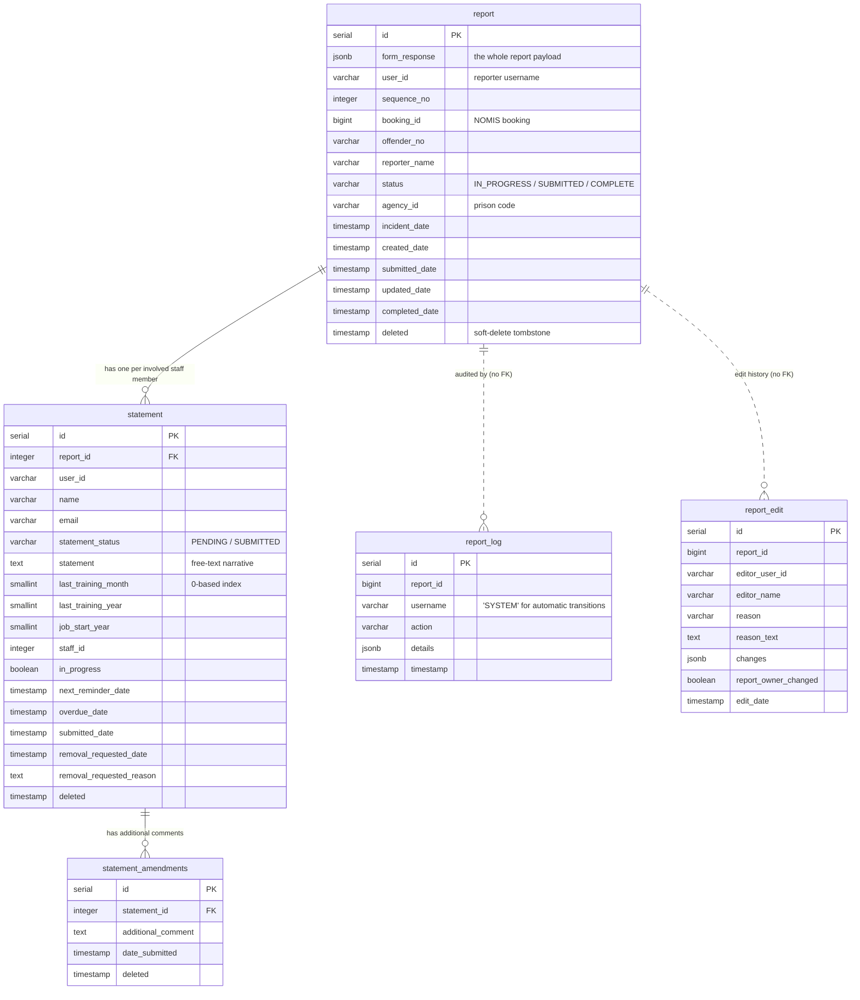

# Data model

The database is owned by **this repository**, via the knex migrations in `migrations/`. The Kotlin
`hmpps-uof-data-api` reads it but has no production migrations — do not put schema changes there.

## Entity relationships



## The five rules that catch people out

1. **Nothing is ever hard-deleted.** `deleted` is a timestamp tombstone.
2. **Read and write through the views, not the base tables.** `v_report`, `v_statement` and
   `v_statement_amendments` are `SELECT * … WHERE deleted IS NULL`. They are simple auto-updatable
   Postgres views, so `INSERT INTO v_statement_amendments …` and `UPDATE v_report SET …` both work.
   Query a base table and you will see soft-deleted rows.
3. **There is no `draft` table.** A draft is a `report` row with `status = 'IN_PROGRESS'`.
4. **`report.status` has no CHECK constraint**, and `report` has no outbound foreign keys.
   Integrity is enforced by the application.
5. **`report_log.report_id` and `report_edit.report_id` have no foreign key** to `report`. They
   survive the report being soft-deleted.

## Tables

### `report`

| Column | Type | Notes |
| --- | --- | --- |
| `id` | serial | PK (constraint is named `pk_form` — the table was once called `form`). |
| `form_response` | jsonb | The whole payload. See [report-payload.md](report-payload.md). |
| `user_id` | varchar(32) | Reporter's HMPPS username. Not null. |
| `sequence_no` | integer | Not null, default 1. Computed as `MAX(sequence_no) + 1` for that user and booking. |
| `booking_id` | bigint | Not null, default -1. NOMIS booking id. |
| `created_date` | timestamp | Not null, default `now(6)`. |
| `status` | varchar(20) | `IN_PROGRESS` / `SUBMITTED` / `COMPLETE`. No constraint. |
| `submitted_date` | timestamp | |
| `offender_no` | varchar(32) | Not null. |
| `reporter_name` | varchar(128) | Not null. |
| `incident_date` | timestamp | **Extracted out of the JSON** into its own column. |
| `agency_id` | varchar(6) | Prison code, e.g. `MDI`. Stamped at creation, updatable via the "change prison" flow. |
| `updated_date` | timestamp | |
| `deleted` | timestamp | Soft-delete tombstone. |
| `completed_date` | timestamp | Added October 2025. **Nothing writes or reads it yet.** |

Indexes: partial unique `(user_id, booking_id, sequence_no) WHERE deleted IS NULL`; btree on
`offender_no`, `created_date`, `incident_date`, `status`.

### `statement`

One row per member of staff who must provide a statement, created when the report is submitted. The
table was originally called `involved_staff`, which still shows in its index names.

| Column | Type | Notes |
| --- | --- | --- |
| `id` | serial | PK. |
| `report_id` | integer | FK → `report(id)` **ON DELETE CASCADE**. Not null. |
| `user_id`, `name`, `email`, `staff_id` | | The staff member. `email` may be backfilled later by the reminder job. |
| `statement_status` | varchar(255) | `PENDING` / `SUBMITTED`. Not null. |
| `statement` | text | The free-text narrative. |
| `last_training_month` | smallint | **0-based month index (0–11), not 1–12.** |
| `last_training_year`, `job_start_year` | smallint | |
| `in_progress` | boolean | Not null, default false. Set when a draft statement is saved. |
| `next_reminder_date` | timestamp | Submit + 1 day initially; advances daily; nulled once overdue. |
| `overdue_date` | timestamp | Submit + 3 days. |
| `submitted_date`, `created_date`, `updated_date` | timestamp | |
| `removal_requested_date`, `removal_requested_reason` | | Set when the staff member asks to be removed. |
| `deleted` | timestamp | |

Indexes: partial unique `(report_id, user_id) WHERE deleted IS NULL`;
`(next_reminder_date, statement_status)`; `report_id`.

### `statement_amendments`

Additional comments added after a statement has been submitted. FK → `statement(id)` **ON DELETE
CASCADE**.

### `report_log`

The audit trail. `action` is one of `REPORT_CREATED`, `REPORT_MODIFIED`, `REPORT_DELETED`,
`REPORT_SUBMITTED`, `REPORT_STATUS_CHANGED`, `REPORT_COMPLETED`. Automatic transitions are recorded
with `username = 'SYSTEM'`.

### `report_edit`

Post-submission edit history, written by the coordinator edit flow. `changes` is a
`Record<string, {oldValue, newValue, question}>` — see
[report-payload.md](report-payload.md#report_editchanges).

### Views

```sql
CREATE VIEW v_report               AS SELECT * FROM report               WHERE deleted IS NULL;
CREATE VIEW v_statement            AS SELECT * FROM statement            WHERE deleted IS NULL;
CREATE VIEW v_statement_amendments AS SELECT * FROM statement_amendments WHERE deleted IS NULL;
CREATE VIEW flyway_schema_history  AS SELECT name AS version FROM knex_migrations ORDER BY id;
```

A few queries deliberately bypass the `v_*` views and hit the base tables — `deleteReport`,
`getNextNotificationReminder` and `requestStatementRemoval`. That is intentional; leave it alone
unless you understand why.

> **`flyway_schema_history` is a fake.** It is a view over `knex_migrations`, created by
> `migrations/20241120000001_form_db.js` purely to satisfy the HMPPS SAR test-support library's
> schema-version assertion. **This is not a Flyway repository.** Anything that runs Flyway against
> the real database will collide with it, and anything that publishes the schema should exclude it.

## Data access

`server/data/dataAccess/db.ts` exposes a `pg` `Pool`, a `query` function, and `inTransaction`:

```ts
export const inTransaction: InTransaction = async callback => {
  const client = await pool.connect()
  try {
    await client.query('BEGIN')
    const result = await callback(q => client.query(q))
    await client.query('COMMIT')
    return result
  } catch (error) {
    await client.query('ROLLBACK')
    throw error
  } finally {
    client.release()
  }
}
```

### The `QueryPerformer` idiom

This is the single most important pattern in the data layer. **Every DAO method takes an optional
trailing `query` argument**, defaulting to the pool:

```ts
async submit(reportId: number, userId: string, submittedDate: Date, query: QueryPerformer = this.query) {
  // ...
}
```

Callers that need atomicity pass the transactional client down instead, which enlists the call in
their transaction. That is how multi-table atomic operations are composed without an ORM:

```ts
await this.inTransaction(async query => {
  const statements = await this.statementsClient.createStatements(..., query)
  await this.draftReportClient.submit(reportId, userId, now, query)
  return statements
})
```

Services that do this: `statementService.submitStatement`, `submitDraftReportService`,
`involvedStaffService`, `reportService`, and `job/reminders/reminderPoller`. `reportLogClient` always
*requires* a `QueryPerformer`, so audit rows are always written inside the caller's transaction.

> **Known defect:** several `reportService` methods call `this.inTransaction(...)` without awaiting
> the returned promise (`update`, `updateWithEdits`, `updateTwoReportSections`,
> `deleteIncidentAndUpdateReportEdit`). Don't copy that.

### The DB clients

| Client | Owns |
| --- | --- |
| `draftReportClient.ts` | The `IN_PROGRESS` lifecycle: create, patch a section, change prison, find duplicates, submit, cancel. |
| `incidentClient.ts` | Submitted and complete reports: status transitions, reviewer queries (paged with `count(*) OVER()`), edits, report deletion, and the reminder work-queue claim. |
| `statementsClient.ts` | Statements and amendments. Also the one place using `pg-format`, for the bulk multi-row insert in `createStatements`. |
| `reportLogClient.ts` | Audit rows only. |

Everything else in `server/data/` is a REST client, not a database client.

## Migrations

Knex files in `migrations/`, run automatically at boot from `server.ts`. Roughly 30 of them,
recording the service's history — the `form` → `incidents` → `report` renames, the `involved_staff` →
`statement` rename, and the introduction of soft deletes.

Conventions to follow:

- One file per change, named `YYYYMMDDHHMMSS_form_db.js`. Yes, they are nearly all called
  `form_db` — that is the existing convention.
- Because migrations run at boot, **a migration ships to every environment on deploy**, before the
  app accepts traffic. Keep them fast and backward-compatible with the currently running version.
- **Changing the payload shape means writing a data migration** for historical rows. There is
  precedent: `20200918000000_form_db.js` moved `involvedStaff` out of `incidentDetails` to the top
  level, and `20210421000000_form_db.js` fixed the `SPECIAL_ACCOMODATION` → `SPECIAL_ACCOMMODATION`
  spelling. Use `jsonb_set` and remember old rows will not have new fields.
- If you add a column that a view exposes, **recreate the view** — several migrations exist solely to
  do this.
