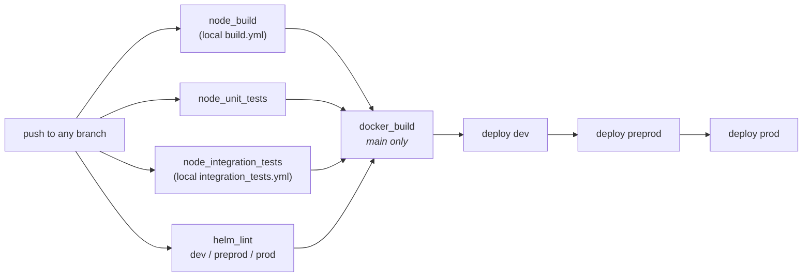

# Deployment

## Environments

| Environment | Namespace | Host |
| --- | --- | --- |
| dev | `use-of-force-dev` | `dev.use-of-force.service.justice.gov.uk` |
| preprod | `use-of-force-preprod` | `preprod.use-of-force.service.justice.gov.uk` |
| prod | `use-of-force-prod` | `use-of-force.service.justice.gov.uk` |

All three are on the `live` Cloud Platform cluster. Their infrastructure (RDS, ElastiCache, service
accounts) is defined in
[cloud-platform-environments](https://github.com/ministryofjustice/cloud-platform-environments) under
`namespaces/live.cloud-platform.service.justice.gov.uk/<namespace>`.

> The namespace names appear **nowhere in this repository** — they live in GitHub Environments
> consumed by the shared `hmpps-github-actions` workflows. That is why they are recorded here.

Product id: **`DPS045`**.

## Pipeline

CI is GitHub Actions. There is no CircleCI, despite what older documentation and badges implied.



`.github/workflows/pipeline.yml` orchestrates this. Deploys are sequential and use
`ministryofjustice/hmpps-github-actions/.github/workflows/deploy_env.yml@v2`. Images go to
`ghcr.io/ministryofjustice/use-of-force`.

Two deliberate deviations from the shared HMPPS workflows:

- **`build.yml` is local**, not the shared `node_build.yml`. The comment in the file attributes this
  to `govuk_frontend_toolkit`; it can go once that legacy Sass dependency is replaced.
- **`integration_tests.yml` is local**, using GitHub Actions `services:` for Postgres and Redis plus a
  downloaded `wiremock-standalone-3.9.1.jar` rather than `docker-compose.test.yml`. Local and CI
  wiremock versions can therefore drift, since the compose file uses `wiremock/wiremock:latest`.

To deploy a specific version by hand, use the `deploy_to_env.yml` workflow (`workflow_dispatch`,
choose the environment and pass a version).

Other scheduled workflows: `security_npm_dependency`, `security_trivy`,
`security_veracode_pipeline_scan`, `security_veracode_policy_scan`, and `codeql-analysis` — the last
of which is pinned to the retired `codeql-action@v1` and needs upgrading.

## Helm

Note the layout, which trips people up: **the chart is in a subdirectory, the values files are one
level above it.**

```
helm_deploy/
├── use-of-force/          <- the chart
│   ├── Chart.yaml
│   ├── values.yaml        <- shared values
│   └── templates/job.yaml <- the send-reminders CronJob
├── values-dev.yaml
├── values-preprod.yaml
└── values-prod.yaml
```

```bash
# render locally
helm template helm_deploy/use-of-force --values helm_deploy/values-dev.yaml

# what is deployed
helm --namespace use-of-force-dev list
helm --namespace use-of-force-dev history use-of-force

# roll back
helm --namespace use-of-force-dev rollback use-of-force <revision>
```

Chart dependencies, from `https://ministryofjustice.github.io/hmpps-helm-charts`:
`generic-service`, `generic-prometheus-alerts`, `generic-data-analytics-extractor`.

### Secrets

Supplied by four Kubernetes secrets, mapped in `values.yaml` under `namespace_secrets`:

| Secret | Provides |
| --- | --- |
| `dps-rds-instance-output` | `DB_*` |
| `application-insights` | The App Insights connection string. |
| `use-of-force` | `API_CLIENT_ID`/`SECRET`, `SYSTEM_CLIENT_ID`/`SECRET`, `NOTIFY_API_KEY`, `SESSION_SECRET`, `URL_SIGNING_SECRET`, `TAG_MANAGER_*`. |
| `uof-elasticache-redis` | `REDIS_HOST`, `REDIS_AUTH_TOKEN`. |

None of these are in the repository. They are created by Cloud Platform or by hand in the namespace.

### Per-environment notes

- **dev and preprod** run 2 replicas with `scheduledDowntime.enabled`; **prod** runs 4.
- **preprod** has `serviceAccountName: use-of-force-preprod-to-ap-s3` for the analytics extract.
- **prod** has `postgresDatabaseRestore.enabled` (the preprod-from-prod refresh) and a wider IP
  allowlist covering prisons, private prisons and probation.

## Scheduled workloads

| Job | Schedule | Defined in |
| --- | --- | --- |
| `send-reminders` | `*/5 * * * *` | `helm_deploy/use-of-force/templates/job.yaml` |
| Analytical Platform S3 extract | `0 21 * * *` | `generic-data-analytics-extractor` sub-chart in `values.yaml` |

The reminder CronJob reuses the application image and its environment, running
`node job/sendReminders` with `concurrencyPolicy: Replace` and `activeDeadlineSeconds: 298`. See
[process-flows.md](process-flows.md#statement-reminders).

The analytics extract runs entirely inside the sub-chart — there is no code for it in this
repository.

## Migrations on deploy

Migrations are **not** a separate pipeline step. `server.ts` runs `knex.migrate.latest()` before
`app.listen()`, so every deploy applies any outstanding migrations as the new pods start, before they
accept traffic.

Practical consequences:

- A slow migration delays pod readiness and can fail the rollout.
- During a rolling deploy, old and new pods run against the same schema. Migrations must be
  backward-compatible with the version being replaced.
- There is no way to deploy the code without the migration, or vice versa.

## Monitoring

- **Health**: `/health`, used for both liveness and readiness probes. It aggregates the database,
  hmpps-auth, prison-api and token-verification.
- **Telemetry**: Azure Application Insights. The reminder job reports under the role name
  `use-of-force-reminder-job`.
- **Alerts**: `generic-prometheus-alerts`.

> `alertSeverity` is currently `move-a-prisoner-alerts-nonprod` / `-prod`, so alerts route to the
> **Move a Prisoner** channels. This needs to change as part of the move to the Manage Safety team —
> it is a tracked follow-up.

## Docker image

Two stages, both `node:22.12-bookworm-slim`.

The builder installs build tools, downloads the **RDS global truststore** to `/app/root.cert` (used
by `knexfile.ts` when `DB_SSL_ENABLED=true`), then runs `npm run setup && npm run build &&
npm run record-build-info` with `CYPRESS_INSTALL_BINARY=0`, and prunes to production dependencies.

The runtime stage asserts `BUILD_NUMBER`, `GIT_REF` and `GIT_BRANCH` are set, runs as uid/gid 2000,
sets `TZ=Europe/London`, and copies the **contents** of `dist/` into `/app` — which is why
`CMD ["npm","start"]` resolves to `node server.js` despite there being no `start` script.
