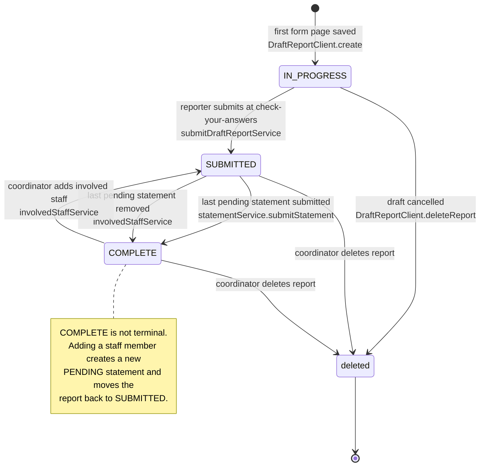
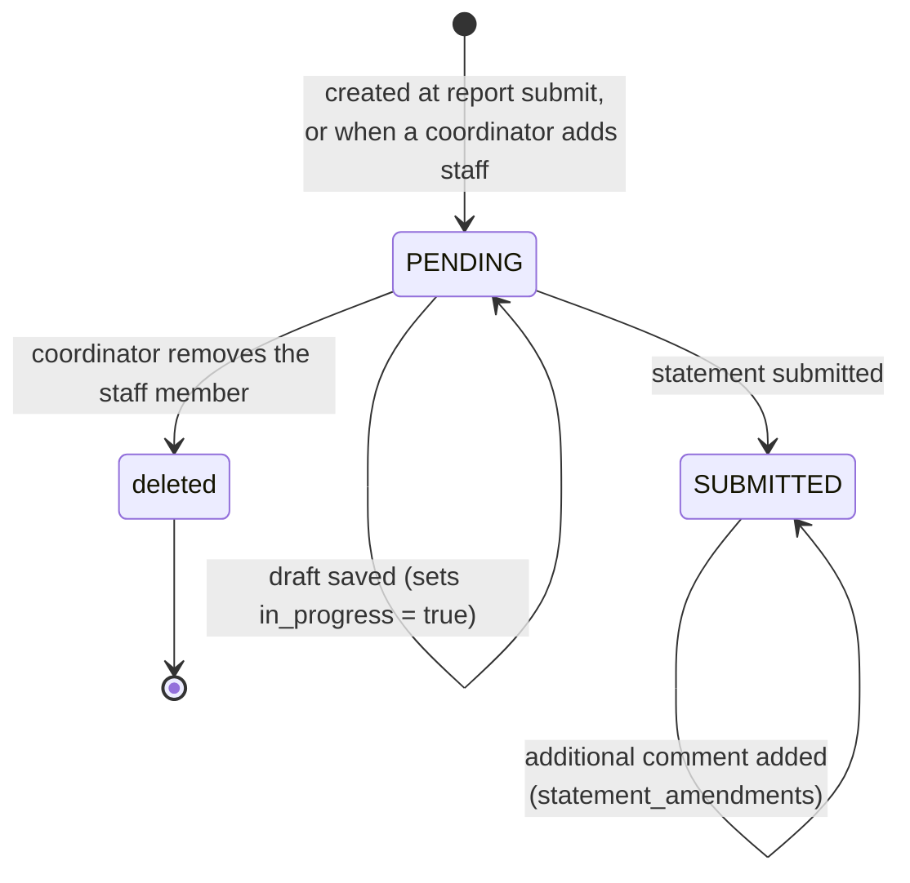
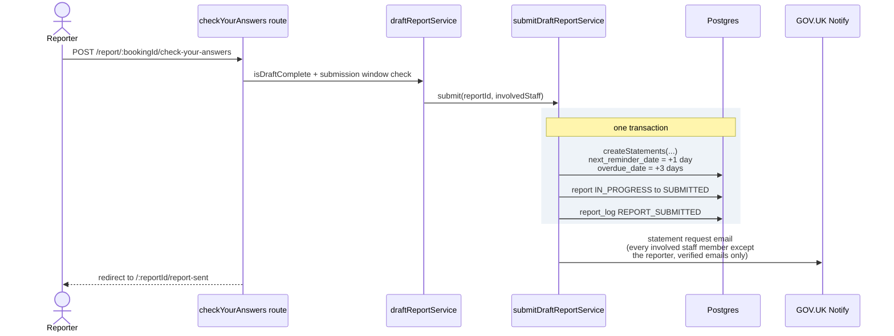
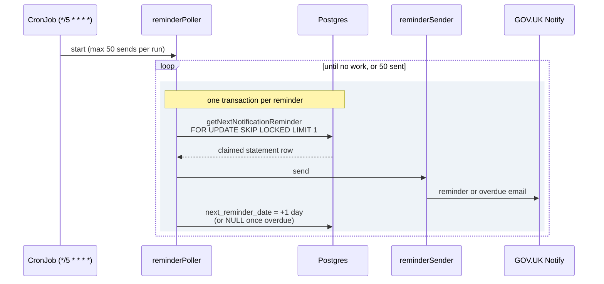
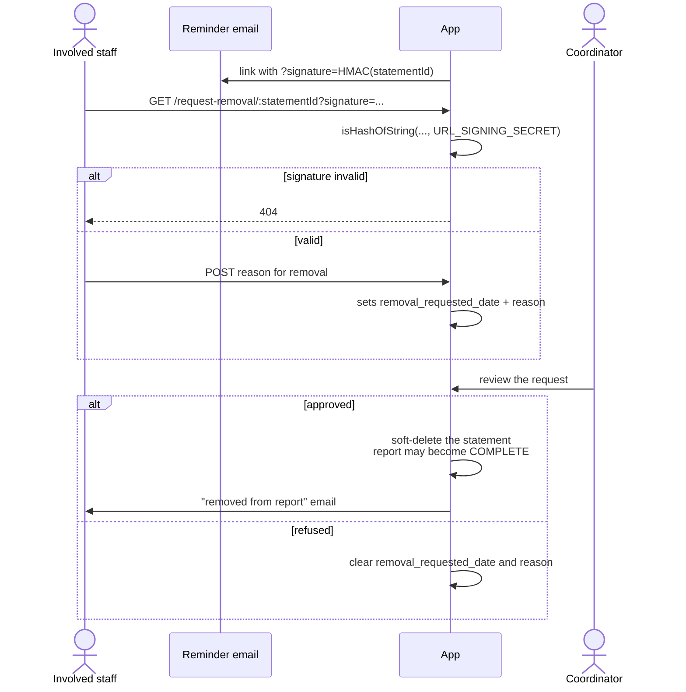

# Process flows

## Report lifecycle

There is no state-machine class. Transitions are enforced by SQL guards of the form
`UPDATE v_report SET status = $new WHERE id = $id AND status = $expected`, always via
`IncidentClient.changeStatus` or `DraftReportClient.submit`.



Two edges surprise people:

- **`SUBMITTED → COMPLETE` happens twice over.** It fires when the last pending statement is
  submitted, and also when the last pending statement is *removed* by a coordinator. Both paths
  recount pending statements and flip the report if the count reaches zero.
- **`COMPLETE → SUBMITTED` is a real transition.** A completed report is not frozen.

Automatic transitions are audited in `report_log` under the username `SYSTEM` (there are
`// TODO provide real username` comments at those call sites).

### Draft section completeness

Separate from report status, `server/services/drafts/reportStatusChecker.ts` computes per-section
progress for the task list:

```ts
export enum SectionStatus { NOT_STARTED, INCOMPLETE, COMPLETE }
```

`check(report)` runs each section's **full** Joi schema against the stored JSON and returns a status
per section plus an overall `complete` flag. That flag also drives the "jump straight to check your
answers" redirect described in
[creating-and-editing-a-report.md](creating-and-editing-a-report.md#navigation).

## Statement lifecycle



Three flags are orthogonal to the status, not extra states:

| Flag | Meaning |
| --- | --- |
| `in_progress` | A draft has been saved but not submitted. |
| overdue | `overdue_date <= now()`. Set to submit + 3 days. |
| removal requested | `removal_requested_date is not null`, with a reason. A coordinator approves (deletes the statement) or refuses. |

## Report submission



Emails are sent **after** the transaction commits, deliberately: a Notify failure must not roll back
a submitted report. The trade-off is that a failure there leaves a submitted report whose staff were
never told. The reminder job is the backstop.

Staff whose email address was unverified at submission time get no email and no `email` value on
their statement row; `job/reminders/emailResolver.ts` re-checks manage-users API on each reminder run
and backfills it.

## Statement reminders

A Kubernetes CronJob, not an in-process timer. `helm_deploy/use-of-force/templates/job.yaml` runs
`node job/sendReminders` every five minutes, with `concurrencyPolicy: Replace` and
`activeDeadlineSeconds: 298`.



`FOR UPDATE … SKIP LOCKED` is what makes concurrent or overlapping runs safe. `reminderSender`
chooses between four Notify templates based on `reminder.isReporter` and `reminder.isOverdue`.
Setting `next_reminder_date` to `NULL` is terminal — no further reminders for that statement.

Run it locally with `npm run send-reminders` (which compiles nothing, so `npm run build` first, and
which forces `DB_PORT=5433`).

## Statement removal request

The one unauthenticated flow in the app.



The signature is generated by `getRemovalRequestLink` and verified with `isHashOfString` from
`server/utils/hash.ts` (HMAC-SHA256). The route is mounted **before** `authorisationMiddleware` in
`server/app.ts` — that ordering is load-bearing.

## Timing constants

| Constant | Value | Where |
| --- | --- | --- |
| Statement first reminder | submit + 1 day | `submitDraftReportService.ts` |
| Statement overdue | submit + 3 days | `submitDraftReportService.ts` |
| Subsequent reminders | + 1 day each, until overdue | `job/reminders/reminderPoller.ts` |
| Max sends per reminder run | 50 | `job/reminders/reminderPoller.ts` |
| Reminder job frequency | every 5 minutes | `helm_deploy/use-of-force/templates/job.yaml` |
| Report submit / edit window | `MAX_WEEKS_TO_SUBMIT_OR_EDIT_REPORT`, default **13 weeks** from the incident date | `draftReportService.isIncidentDateWithinSubmissionWindow`, `reportEditService.isTodaysDateWithinEditabilityPeriod` |
| Web session expiry | 120 minutes, rolling | `WEB_SESSION_TIMEOUT_IN_MINUTES` |

Outside the submission window, form pages render read-only via `pages/draftReportViewOnly/index.njk`
rather than erroring.
